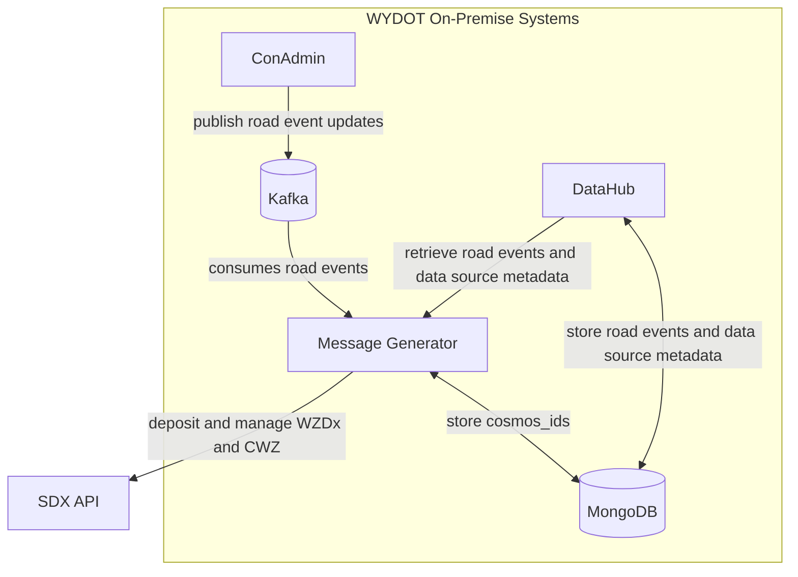

# Smart Work Zone Message Translators

This repository contains WZDx and CWZ message generators and translators for smart work zone applications.

## Architecture Overview

```mermaid
flowchart
    subgraph Internal["WYDOT On-Premise Systems"]
        ConAdmin[ConAdmin]
        Kafka[(Kafka)]
        MessageGenerator[Message Generator]
        DataHub[DataHub]
        MongoDB[(MongoDB)]
    end

    SDX[SDX API]

    ConAdmin -->|"publish road event updates"| Kafka
    Kafka -->|"consumes road events"| MessageGenerator
    MessageGenerator -->|"deposit and manage WZDx and CWZ"| SDX
    MessageGenerator <-->|"store cosmos_ids"| MongoDB
    DataHub -->|"retrieve road events and data source metadata"| MessageGenerator
    DataHub <-->|"store road events and data source metadata"| MongoDB
```
